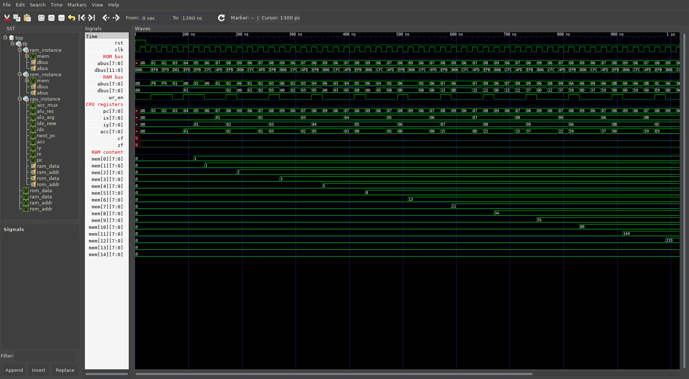

# uCPU #

A toy Harvard-architecture uCPU realized in Verilog and VHDL. Assembler included.
(C) 2022-2023, Stanislav Maslovski <stanislav.maslovski@gmail.com>

For documentation please see the comments within the source code.

Source code directory tree structure:

* rtl - single-cycle uCPU in Verilog.
* tb  - simple testbench in Verilog.

* vhdl/rtl - single-cycle uCPU in VHDL.
* vhdl/tb  - simple testbench in VHDL.

* pipelined/rtl - pipelined uCPU in Verilog.
* pipelined/tb  - simple testbench in Verilog.

* assembler - two-pass assembler for uCPU written in C with example programs.

